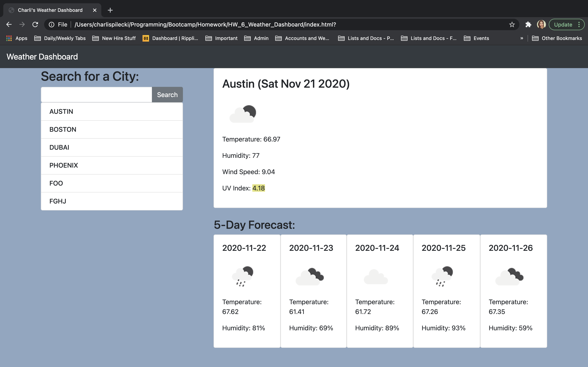

# HW_6_Weather_Dashboard

## About This Project 
For this project, I worked with HTML, CSS (including Bootstrap), and Javascript (including JSON, JQuery, local storage, etc.) to create a weather dashboard where the user can view the weather (temperature, humidity, UV index, etc) for any city. The weather dashboard also displays a 5 day forecast. 

## Screenshot

## Links
https://charlispilecki.github.io/HW_6_Weather_Dashboard/
https://github.com/charlispilecki/HW_6_Weather_Dashboard 